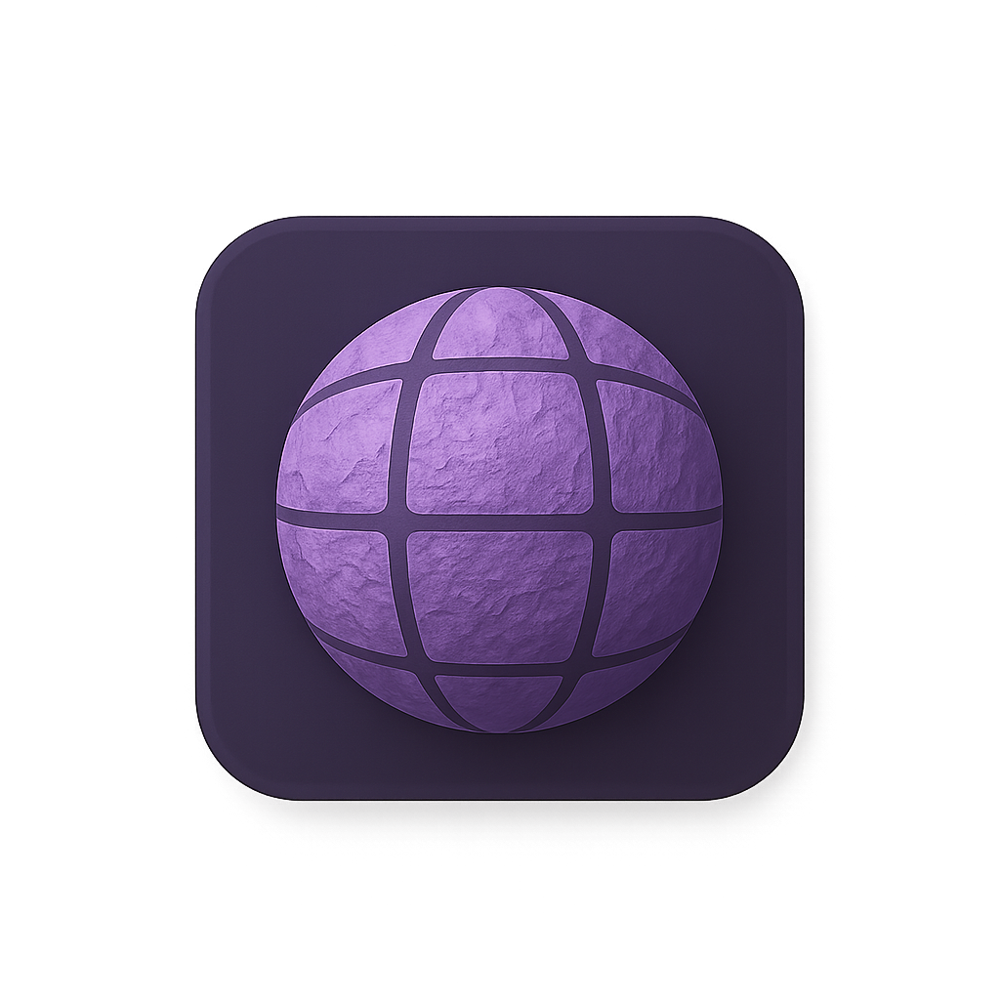

  

<h2 align="center">MateriAI – AI Material Generator for Unity</h2>

  <a href="https://matgenai.com/">🌐 Try It Online</a>

---

**MateriAI** lets you generate stunning, game-ready materials directly inside Unreal — using just a **text prompt** or an optional **image**.  
No complex tools. No texture painting. Just type, click, and create.

---

### 🎯 Use Cases
- 🎮 Game developers building environments and prototypes
- 🖌️ Artists experimenting with fast material ideas
- 🏛️ Archviz and design studios creating mood boards and scenes
- 🧪 Hackathon and jam teams needing speed and flexibility

---

### ⚡ Key Features
- 🧠 AI-powered PBR texture generation: **Base Color**, **Normal**, **Roughness**
- 🖼️ Optional reference image input for style control
- 🧱 2D live previews
- 💾 One-click saving to project
- 🛠️ Built-in Render Pipeline support *(URP & HDRP coming soon)*

> It's simple. It's fast. It's built for creators.

---

## 📸 Preview

  

---

## 📥 Installation

1. Download the latest `.unitypackage` from the [Releases](https://github.com/Olivera2708/MateriAIUnity/releases)
2. In Unity, go to `Assets > Import Package > Custom Package...`
3. Select the file and import all

---

## 📄 License

MateriAI is free to use in **personal and commercial Unity projects**.  
Redistribution, resale, or uploading to asset stores is **not permitted**.

See [LICENSE.md](./LICENSE.md) for full terms.

---

## 💬 Contact

We’d love your feedback and suggestions!

📧 **matgenai.office@gmail.com**  
🌐 [matgenai.com](https://matgenai.com/)
